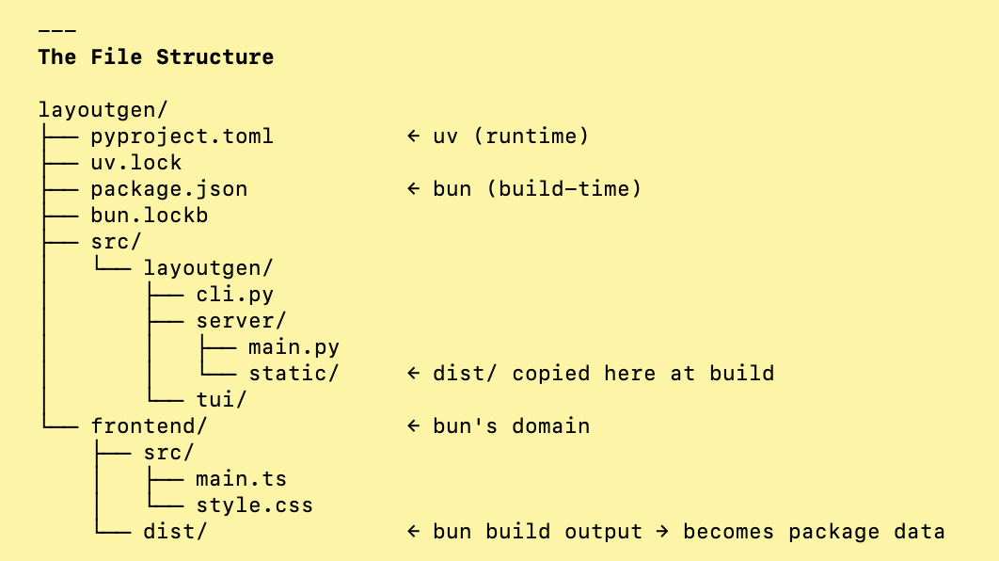
# Writer-ORG (WIP)
Generative design tool with a terminal UI — compose layouts, render to canvas, export to SVG/PDF. Lorem ipsum dolor sit amet, consetetur sadipscing elitr, sed diam nonumy eirmod tempor invidunt ut labore et dolore magna aliquyam erat, sed diam voluptua. At vero eos et accusam et justo duo dolores et ea rebum. Stet clita kasd gubergren, no sea takimata sanctus est Lorem ipsum dolor sit amet. Lorem ipsum dolor sit amet, consetetur sadipscing elitr, sed diam nonumy eirmod tempor invidunt ut labore et dolore magna aliquyam erat, sed diam voluptua. At vero eos et accusam et justo duo dolores et ea rebum. Stet clita kasd gubergren, no sea takimata sanctus est Lorem ipsum dolor sit amet.

[Features](#features) / 
[Installation](#installation) / 
[Configuration](#configuration) / 
[Reference](#reference) / 
[Gallery](#gallery)


## Features
(Drop Video here). Lorem ipsum dolor sit amet, consetetur sadipscing elitr, sed diam nonumy eirmod tempor invidunt ut labore et dolore magna aliquyam erat, sed diam voluptua. At vero eos et accusam et justo duo dolores et ea rebum. Stet clita kasd gubergren, no sea takimata sanctus est Lorem ipsum dolor sit amet. Lorem ipsum dolor sit amet, consetetur sadipscing elitr, sed diam nonumy eirmod tempor invidunt ut labore et dolore magna aliquyam erat, sed diam voluptua. At vero eos et accusam et justo duo dolores et ea rebum. Stet clita kasd gubergren, no sea takimata sanctus est Lorem ipsum dolor sit amet.

(Drop Video here). Lorem ipsum dolor sit amet, consetetur sadipscing elitr, sed diam nonumy eirmod tempor invidunt ut labore et dolore magna aliquyam erat, sed diam voluptua. At vero eos et accusam et justo duo dolores et ea rebum. Stet clita kasd gubergren, no sea takimata sanctus est Lorem ipsum dolor sit amet. Lorem ipsum dolor sit amet, consetetur sadipscing elitr, sed diam nonumy eirmod tempor invidunt ut labore et dolore magna aliquyam erat, sed diam voluptua. At vero eos et accusam et justo duo dolores et ea rebum. Stet clita kasd gubergren, no sea takimata sanctus est Lorem ipsum dolor sit amet.

## Installation
Lorem ipsum dolor sit amet, consetetur sadipscing elitr, sed diam nonumy eirmod tempor invidunt ut labore et dolore magna aliquyam erat, sed diam voluptua. At vero eos et accusam et justo duo dolores et ea rebum.

### Melpa
Lorem ipsum dolor sit amet, consetetur sadipscing elitr, sed diam nonumy eirmod tempor invidunt ut labore et dolore magna aliquyam erat, sed diam voluptua. At vero eos et accusam et justo duo dolores et ea rebum. Lorem ipsum dolor sit amet, consetetur sadipscing elitr, sed diam nonumy eirmod tempor invidunt ut labore et dolore magna aliquyam erat, sed diam voluptua.

### Manual
Lorem ipsum dolor sit amet, consetetur sadipscing elitr, sed diam nonumy eirmod tempor invidunt ut labore et dolore magna aliquyam erat, sed diam voluptua
```bash
git clone https://github.com/andri-berger/writer-org
~/.emacs.d/writer-org # Clone the repository
```
```lisp
(use-package writer-org
  :ensure nil
  :defer t
  :load-path
  "/.emacs.d/
  writer-org")
```

## Configuration
Lorem ipsum dolor sit amet, consetetur sadipscing elitr, sed diam nonumy eirmod tempor invidunt ut labore et dolore magna aliquyam erat, sed diam voluptua. At vero eos et accusam et justo duo dolores et ea rebum.

```lisp
(use-package writer-org
  :if window-system
  :custom
  (writer-org-00 nil)
  (writer-org-01 nil)
  (writer-org-02 nil)
  (writer-org-03 nil)
  (writer-org-04 nil)
  (writer-org-05 50)
  (writer-org-06 0)
  (writer-org-07 0)
  (writer-org-08 0)
  (writer-org-09 0)
  (writer-org-10 0)
  (writer-org-11 0)
  (writer-org-12 0)
  (writer-org-13 0)
  (writer-org-14 0)
  (writer-org-15 "/")
  (writer-org-16 " // ")
  (writer-org-17 "writer")
  (writer-org-18 'unspecified)
  (writer-org-19 'unspecified)  
  :bind ( :map writer-org-mode-map
          ("<f5>" . writer-org-map)
          ("<f6>" . writer-org-mode)
          ("<f7>" . writer-org-load))
  :hook (org-mode . writer-org-mode)
  :commands writer-org-map
  writer-org-mode
  writer-org-load)
```

<table>
    <tr>
        <th align="left">Docs</th>
        <th align="left">Function</th>
        <th align="left">Binding</th>
        <th align="left">Description</th>
    </tr>
    <tr>
        <td width="20"><a href="assets/1744167945.png">
    </a></td>
        <td>writer-org-map</td>
        <td>F5</td>
        <td>Enable navigation-mode. Can be considered a mini-minor mode and is independent of writer-org minor-mode.</td>
    </tr>
    <tr>
        <td width="20"><a href="assets/1744167945.png">
    </a></td>
        <td>writer-org-mode</td>
        <td>F6</td>
        <td>Enable/Toggle minor-mode writer-org. Lorem ipsum dolor sit amet.</td>
    </tr>
    <tr>
        <td width="20"><a href="assets/1744167945.png">
    </a></td>
        <td>writer-org-load</td>
        <td>F7</td>
        <td>Enable Refresh (Disabling/REenabling in one go). Needs to be called every time a property has been changed to be reflected (clean principle of one single entry via minor-mode).</td>
    </tr>
</table>


## Reference
Lorem ipsum dolor sit amet, consetetur sadipscing elitr, sed diam nonumy eirmod tempor invidunt ut labore et dolore magna aliquyam erat, sed diam voluptua. At vero eos et accusam et justo duo dolores et ea rebum.

<table>
    <tr>
        <th align="left">Docs</th>
        <th align="left">Property</th>
        <th align="left">Resource</th>
        <th align="left">Default</th>
        <th align="left">Description</th>
    </tr>
    <tr>
        <td width="20">
        <a href="asset/1744167631.png">
        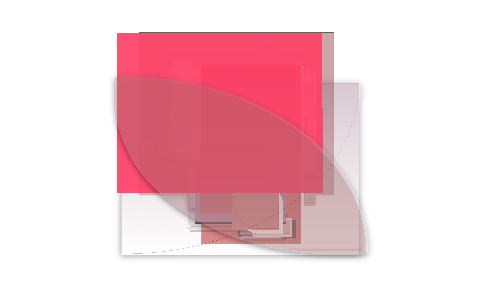
        </a></td><td>writer-org-00</td>
        <td>boolean</td>
        <td>nil</td>
        <td>Enable centering in typing-mode. Lorem ipsum dolor sit amet, consetetur sadipscing elitr, sed diam nonumy eirmod tempor invidunt ut labore et dolore magna aliquyam erat.</td>
    </tr>
    <tr>
        <td width="20">
        <a href="asset/1744167625.png">
        
        </a></td><td>writer-org-01</td>
        <td>boolean</td>
        <td>nil</td>
        <td>Enable anchoring in navigation-mode. Lorem ipsum dolor sit amet.</td>
    </tr>
    <tr>
        <td width="20">
        <a href="asset/1744167620.png">
        
        </a></td><td>writer-org-02</td>
        <td>boolean</td>
        <td>nil</td>
        <td>Enable anchoring in org-mode. Lorem ipsum dolor sit amet.</td>
    </tr>
    <tr>
        <td width="20">
        <a href="asset/1744167616.png">
        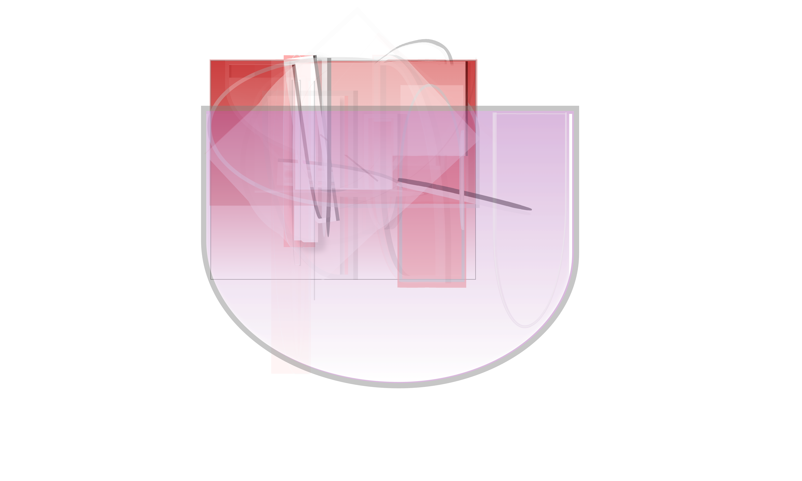
        </a></td><td>writer-org-03</td>
        <td>boolean</td>
        <td>nil</td>
        <td>LTR vs RTL Alignment. Lorem ipsum dolor sit amet.</td>
    </tr>
    <tr>
        <td width="20">
        <a href="asset/1744167612.png">
        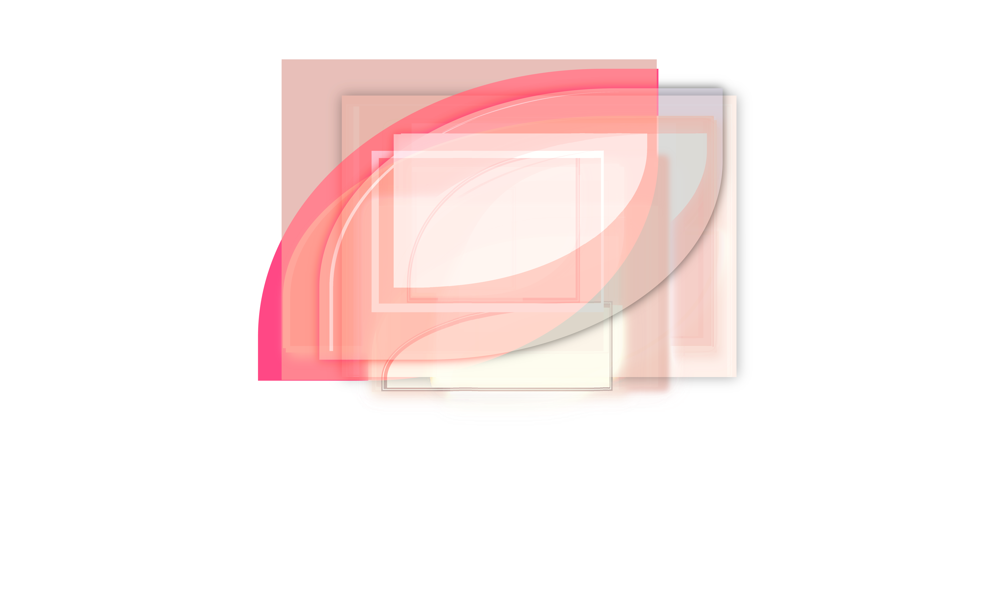
        </a></td><td>writer-org-04</td>
        <td>boolean </td>
        <td>nil</td>
        <td>Centering horizontally. Lorem ipsum dolor sit amet.</td>
    </tr>
    <tr>
        <td width="20">
        <a href="asset/1744167606.png">
        
        </a></td><td>writer-org-05</td>
        <td>integer</td>
        <td>50</td>
        <td>Max-width in chars. Lorem ipsum dolor sit amet.</td>
    </tr>
    <tr>
        <td width="20">
        <a href="asset/1744167598.png">
        
        </a></td><td>writer-org-06</td>
        <td>integer</td>
        <td>0</td>
        <td>Left fringe width in px. Lorem ipsum dolor sit amet.</td>
    </tr>
    <tr>
        <td width="20">
        <a href="asset/1744167592.png">
        
        </a></td><td>writer-org-07</td>
        <td>integer</td>
        <td>0</td>
        <td>Vertical gap at the edge in px. Lorem ipsum dolor sit amet.</td>
    </tr>
    <tr>
        <td width="20">
        <a href="asset/1744167582.png">
        
        </a></td><td>writer-org-08</td>
        <td>integer</td>
        <td>0</td>
        <td>Vertical gap fringe left in px. Lorem ipsum dolor sit amet.</td>
    </tr>
    <tr>
        <td width="20">
        <a href="asset/1744167579.png">
        
        </a></td><td>writer-org-09</td>
        <td>select 0-3</td>
        <td>0</td>
        <td>Line-styles. 
        <br>0 = Lorem ipsum dolor sit amet. 
        <br>1 = Lorem ipsum dolor sit amet. 
        <br>2 = Lorem ipsum dolor sit amet. 
        <br>3 = Lorem ipsum dolor sit amet.</td>
    </tr>
    <tr>
        <td width="20">
        <a href="asset/1744167573.png">
        
        </a></td><td>writer-org-10</td>
        <td>select 0-3</td>
        <td>0</td>
        <td>Hierarchy treshold. 
        <br>0 = Lorem ipsum dolor sit amet. 
        <br>1 = Lorem ipsum dolor sit amet. 
        <br>2 = Lorem ipsum dolor sit amet. 
        <br>3 = Lorem ipsum dolor sit amet.</td>
    </tr>
    <tr>
        <td width="20">
        <a href="asset/1744167569.png">
        
        </a></td><td>writer-org-11</td>
        <td>select 0-3</td>
        <td>0</td>
        <td>Lines config header. 
        <br>0 = Lorem ipsum dolor sit amet. 
        <br>1 = Lorem ipsum dolor sit amet. 
        <br>2 = Lorem ipsum dolor sit amet. 
        <br>3 = Lorem ipsum dolor sit amet.</td>
    </tr>
    <tr>
        <td width="20">
        <a href="asset/1744167566.png">
        
        </a></td><td>writer-org-12</td>
        <td>select 0-3</td>
        <td>0</td>
        <td>Lines config mode. 
        <br>0 = Lorem ipsum dolor sit amet. 
        <br>1 = Lorem ipsum dolor sit amet. 
        <br>2 = Lorem ipsum dolor sit amet. 
        <br>3 = Lorem ipsum dolor sit amet.</td>
    </tr>
    <tr>
        <td width="20">
        <a href="asset/1744146886.png">
        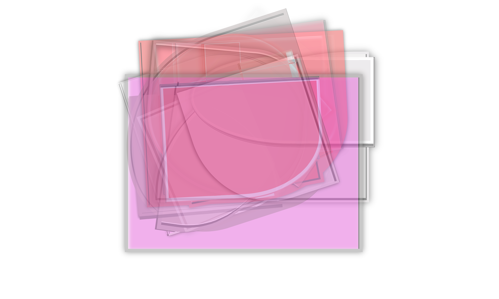
        </a></td><td>writer-org-13</td>
        <td>select 0-3</td>
        <td>0</td>
        <td>Char/line/word header. 
        <br>0 = Lorem ipsum dolor sit amet. 
        <br>1 = Lorem ipsum dolor sit amet. 
        <br>2 = Lorem ipsum dolor sit amet. 
        <br>3 = Lorem ipsum dolor sit amet.</td>
    </tr>
    <tr>
        <td width="20">
        <a href="asset/1744146875.png">
        
        </a></td><td>writer-org-14</td>
        <td>select 0-3</td>
        <td>0</td>
        <td>Char/line/word mode. 
        <br>0 = Lorem ipsum dolor sit amet. 
        <br>1 = Lorem ipsum dolor sit amet. 
        <br>2 = Lorem ipsum dolor sit amet. 
        <br>3 = Lorem ipsum dolor sit amet.</td>
    </tr>
    <tr>
        <td width="20">
        <a href="asset/1744146868.png">
        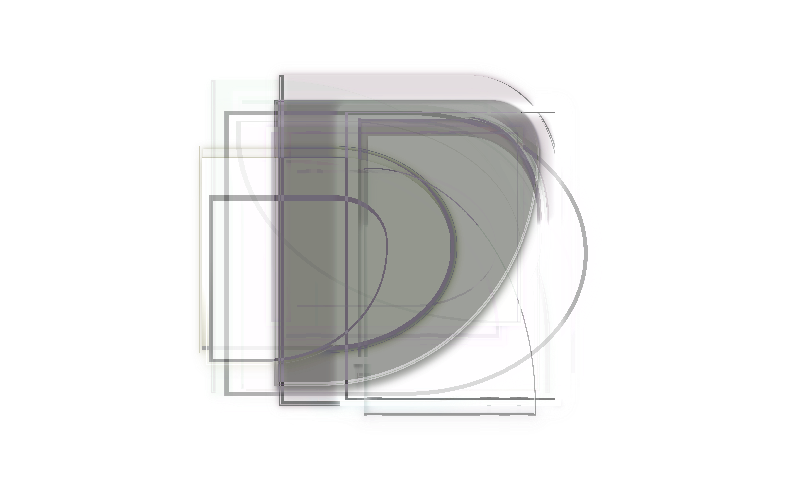
        </a></td><td>writer-org-15</td>
        <td>string</td>
        <td>"/"</td>
        <td>First Separator header / mode. Lorem ipsum dolor sit amet.</td>
    </tr>
    <tr>
        <td width="20">
        <a href="asset/1744146856.png">
        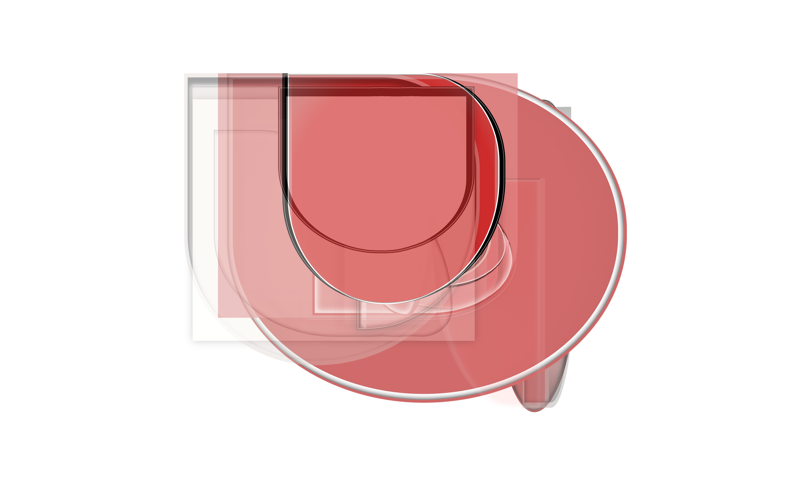
        </a></td><td>writer-org-16</td>
        <td>string</td>
        <td>" // "</td>
        <td>Second separator header / mode. Lorem ipsum dolor sit amet.</td>
    </tr>
    <tr>
        <td width="20">
        <a href="asset/1744146850.png">
        
        </a></td><td>writer-org-17</td>
        <td>string</td>
        <td>"writer"</td>
        <td>Fallback text if no org-parent. Lorem ipsum dolor sit amet.</td>
    </tr>
    <tr>
        <td width="20">
        <a href="asset/1744146368.png">
        
        </a></td><td>writer-org-18</td>
        <td>value</td>
        <td>'unspecified</td>
        <td>Faces inherit header mode line. Lorem ipsum dolor sit amet.</td>
    </tr>
    <tr>
        <td width="20">
        <a href="asset/1744146358.png">
        
        </a></td><td>writer-org-19</td>
        <td>value</td>
        <td>'unspecified</td>
        <td>Custom face of vertical line. Lorem ipsum dolor sit amet.</td>
    </tr>
</table>


## Gallery
Lorem ipsum dolor sit amet, consetetur sadipscing elitr, sed diam nonumy eirmod tempor invidunt ut labore et dolore magna aliquyam erat, sed diam voluptua. At vero eos et accusam et justo duo dolores et ea rebum.

<table>
  <tr>
    <td><a href="assets/1744167945.png">
    </a></td>
    <td><a href="assets/1744167939.png">
    </a></td>
    <td><a href="assets/1744167921.png">
    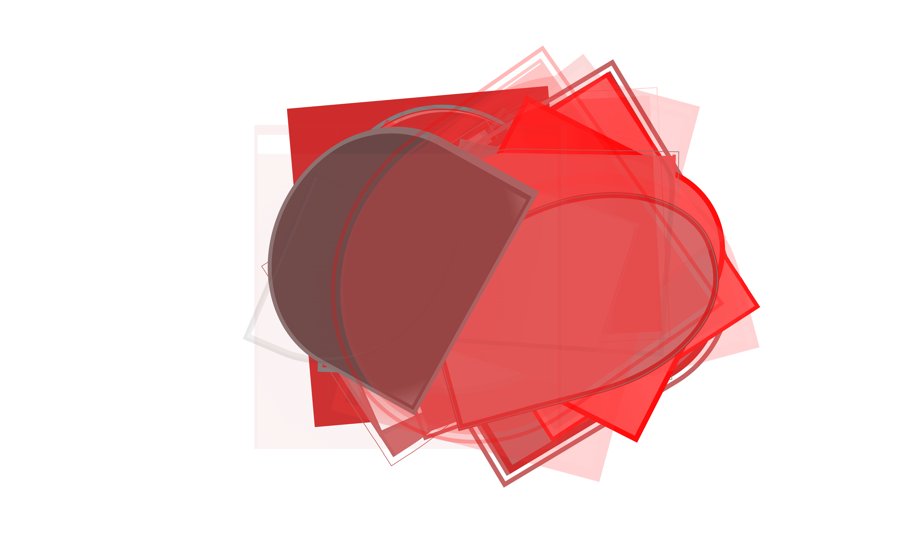</a></td>
    <td><a href="assets/1744167914.png">
    </a></td>
    <td><a href="assets/1744167898.png">
    </a></td>
    <td><a href="assets/1744167891.png">
    </a></td>
  </tr>
  <tr>
    <td><a href="assets/1744167888.png">
    </a></td>
    <td><a href="assets/1744167884.png">
    </a></td>
    <td><a href="assets/1744167882.png">
    </a></td>
    <td><a href="assets/1744167876.png">
    </a></td>
    <td><a href="assets/1744167872.png">
    </a></td>
    <td><a href="assets/1744167860.png">
    </a></td>
  </tr>
  <tr>
    <td><a href="assets/1744167857.png">
    </a></td>
    <td><a href="assets/1744167847.png">
    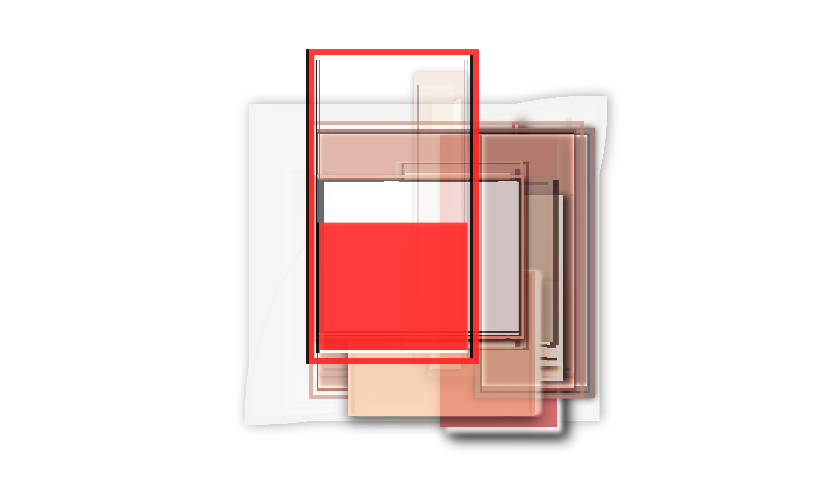</a></td>
    <td><a href="assets/1744167845.png">
    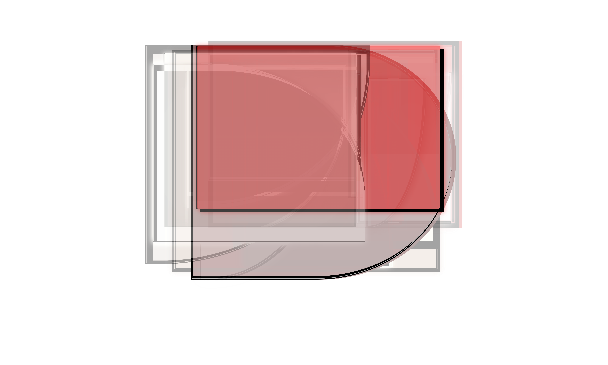</a></td>
    <td><a href="assets/1744167842.png">
    </a></td>
    <td><a href="assets/1744167840.png">
    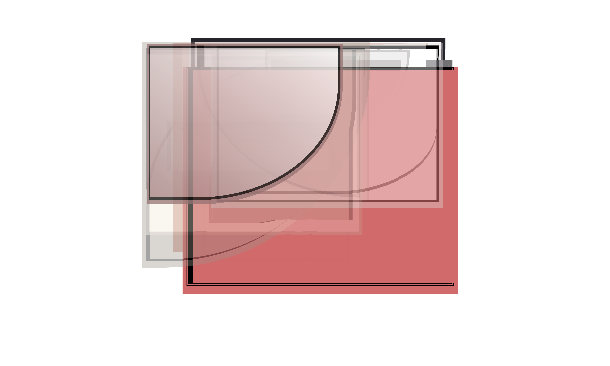</a></td>
    <td><a href="assets/1744167831.png">
    </a></td>
    </tr>
    <tr>
    <td><a href="assets/1744167828.png">
    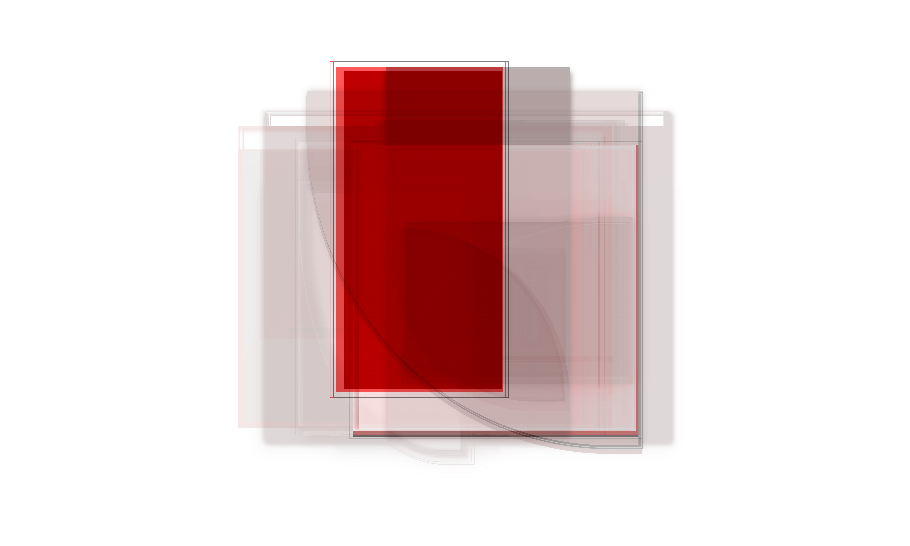</a></td>
    <td><a href="assets/1744167816.png">
    </a></td>
    <td><a href="assets/1744167814.png">
    </a></td>
    <td><a href="assets/1744167762.png">
    </a></td>
    <td><a href="assets/1744167758.png">
    </a></td>
    <td><a href="assets/1744167750.png">
    </a></td>
  </tr>
  <tr>
    <td><a href="assets/1744167747.png">
    </a></td>
    <td><a href="assets/1744167744.png">
    </a></td>
    <td><a href="assets/1744167739.png">
    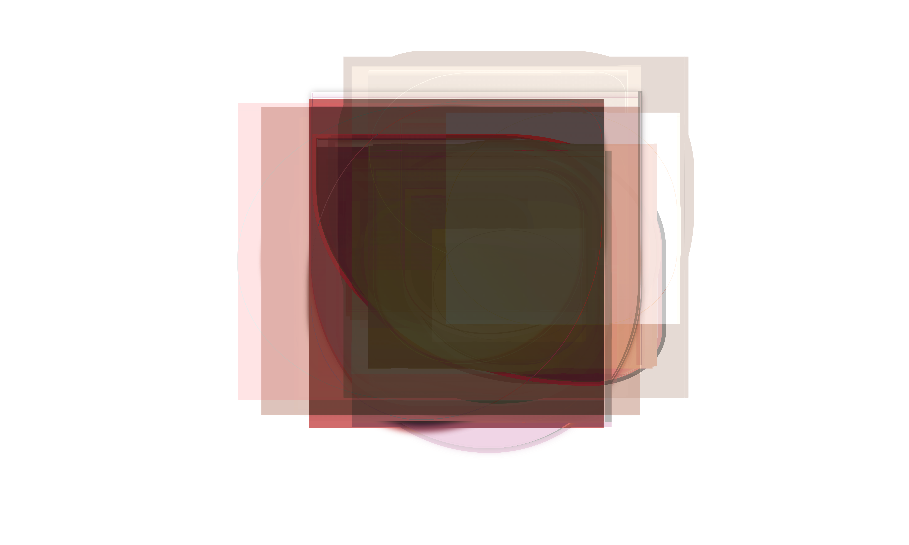</a></td>
    <td><a href="assets/1744167730.png">
    </a></td>
    <td><a href="assets/1744167727.png">
    </a></td>
    <td><a href="assets/1744167725.png">
    </a></td>
  </tr>
  <tr>
    <td><a href="assets/1744167720.png">
    </a></td>
    <td><a href="assets/1744167714.png">
    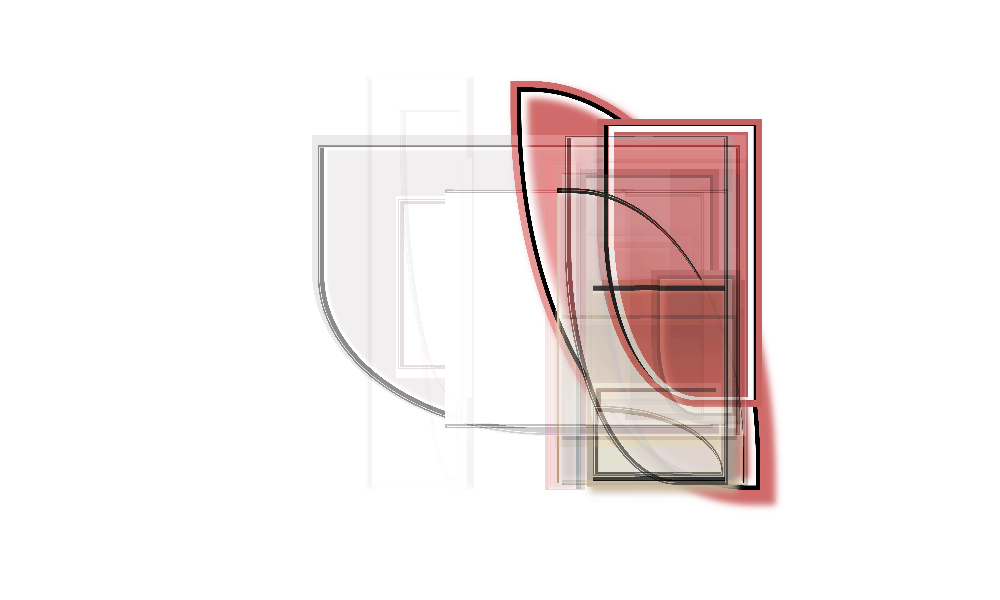</a></td>
    <td><a href="assets/1744167710.png">
    </a></td>
    <td><a href="assets/1744167705.png">
    </a></td>
    <td><a href="assets/1744167640.png">
    </a></td>
    <td><a href="assets/1744167636.png">
    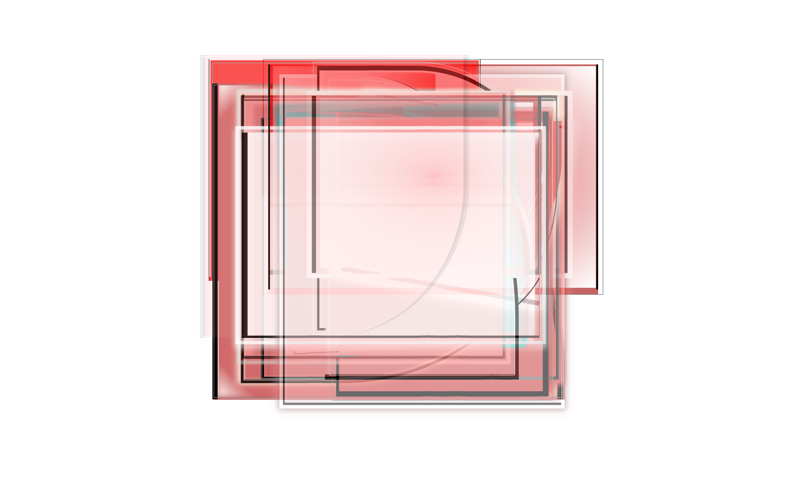</a></td>
  </tr>
</table>

<br>
<br>
<br>
